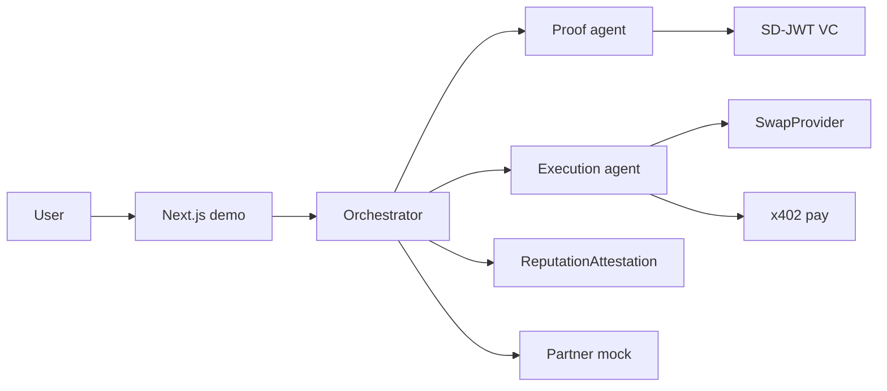

# Proofport

Onchain credit and reputation rail for agentic finance.

A proof-agent discloses the minimum SD-JWT claims. An execution-agent moves funds on a verifier boolean. After a successful cash-out wedge, a PII-free reputation attestation is written on Base Sepolia.

Built for [Runtime](https://runtime.xyz) (Bankr × Propaganda) with Dynamic and Uniswap tracks.

**Demo:** grant authority in the nav, then run cash-out. Revoke locks the pipeline until you grant again.

## Features

- Selective disclosure with SD-JWT VC (`verified` + `country` only)
- Two capability-bounded agents (hard denials in the tool registry, not a prompt)
- Dual wallets on Base Sepolia (execution + proof)
- x402 self-pay compliance check (402 → pay → 200)
- PII-free `ReputationAttestation` contract
- Revocable app-level delegation (Grant / Revoke in the UI)
- Mock licensed-partner hand-off (no fiat)

## Stack

| Layer | Choice |
| --- | --- |
| App | Next.js 16 (App Router) + TypeScript |
| Credentials | `@sd-jwt/sd-jwt-vc` |
| Chain | Base Sepolia, viem |
| Agents | Orchestrator + optional OpenAI |
| Payments | x402 (`manual_header_retry`) |
| Swap | Uniswap SwapProvider, mock fallback |

## Quick start

Requires Node 22+.

```bash
cp .env.example .env
npm install
npm run compile:reputation
npm run deploy:reputation
npm run dev
```

Open [http://localhost:3000](http://localhost:3000).

Fund the execution wallet on Base Sepolia (ETH for gas, Circle USDC for x402). The deploy script needs `EXECUTION_AGENT_PRIVATE_KEY` or `DEMO_AGENT_PRIVATE_KEY`.

## Environment

Copy `.env.example` and set at least:

| Variable | Purpose |
| --- | --- |
| `OPENAI_API_KEY` | Optional LLM agent loop. Demo also runs deterministically. |
| `DEMO_AGENT_PRIVATE_KEY` / `EXECUTION_AGENT_PRIVATE_KEY` | Funded execution wallet |
| `PROOF_AGENT_PRIVATE_KEY` | Optional. Auto-generated if unset |
| `REPUTATION_CONTRACT` | Deployed attestation address |
| `X402_PAY_TO` | Receiver for the compliance-check fee |
| `BASE_SEPOLIA_RPC_URL` | Defaults to `https://sepolia.base.org` |
| `SWAP_PROVIDER` | `auto` (Uniswap then mock), `uniswap`, or `mock` |
| `DYNAMIC_ENVIRONMENT_ID` / `DYNAMIC_API_TOKEN` | Dynamic track. Windows uses local viem |

Never commit `.env`.

## Scripts

```bash
npm run dev
npm run build
npm run balances

npm run smoke:credentials
npm run smoke:capability
npm run smoke:wallet
npm run smoke:reputation
npm run smoke:x402          # needs `npm run dev`
npm run smoke:partner       # needs `npm run dev`
npm run smoke:delegation
npm run smoke:swap
npm run smoke:agent
```

## Architecture



| Surface | Path |
| --- | --- |
| SD-JWT issue / present / verify | [`src/credentials/index.ts`](src/credentials/index.ts) |
| Proof-agent tools | [`src/agents/proof-agent/tools.ts`](src/agents/proof-agent/tools.ts) |
| Execution-agent tools | [`src/agents/execution-agent/tools.ts`](src/agents/execution-agent/tools.ts) |
| Orchestrator | [`src/orchestrator/index.ts`](src/orchestrator/index.ts) |
| Dual wallets | [`src/wallet/dual.ts`](src/wallet/dual.ts) |
| Reputation | [`contracts/ReputationAttestation.sol`](contracts/ReputationAttestation.sol), [`src/reputation/index.ts`](src/reputation/index.ts) |
| x402 | [`src/app/api/compliance-check/route.ts`](src/app/api/compliance-check/route.ts) |
| Uniswap | [`src/swap/uniswap.ts`](src/swap/uniswap.ts) |
| Delegation | [`src/app/api/delegation/route.ts`](src/app/api/delegation/route.ts) |

## Live vs simulated

See [`MOCKS.md`](MOCKS.md). Uniswap notes: [`FEEDBACK.md`](FEEDBACK.md). Phase gates: [`PROGRESS.md`](PROGRESS.md).

| Live | Simulated |
| --- | --- |
| SD-JWT cryptography | Government ID issuer |
| Capability denials | Licensed-partner fiat |
| Onchain reputation write | Uniswap when liquidity is empty |
| x402 402→pay→200 | Dynamic Neon MPC on Windows |

## Grant and Revoke

The nav pills are real controls, not labels.

1. **Grant** turns the chip to `Authority on` and unlocks **Run cash-out**.
2. **Revoke** turns the chip to `Revoked` and the pipeline returns `authority revoked` until you grant again.

State is stored in a cookie (works on Vercel) and in `.data/delegation.json` when the filesystem is writable.

## License

Private hackathon build for Runtime AgentWeek unless the repository owner states otherwise.
